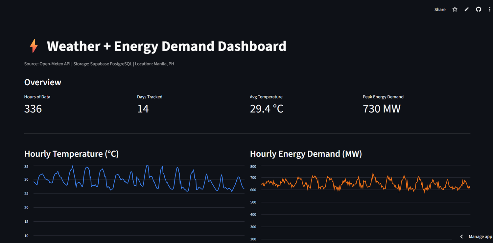

# ⚡ Weather + Energy Demand Pipeline

A fully automated data engineering pipeline that fetches real-time weather data, simulates energy demand, stores it in a cloud database, and visualizes it in a live public dashboard — running on its own every 6 hours with zero manual intervention.

**[🚀 View Live Dashboard](https://weather-energy-pipeline-9khuzsnfjpzqn3neevepj7.streamlit.app)**

---

## Dashboard Preview

<!-- Take a screenshot of your dashboard and drag it into this README in VS Code -->
<!-- Name the file dashboard.png and put it in a screenshots/ folder -->
<!-- Then replace the line below with:  -->


---

## How It Works

```
Every 6 hours (automated)
        ↓
GitHub Actions (cloud server)
        ↓
Open-Meteo API → fetch hourly weather data
        ↓
pandas → clean, enrich, simulate energy demand
        ↓
Supabase PostgreSQL → store incrementally
        ↓
Streamlit Cloud → live public dashboard updates
```

No manual steps. No laptop required. Runs entirely in the cloud.

---

## Tech Stack

| Layer | Tool | Purpose |
|---|---|---|
| Data Source | Open-Meteo API | Free real-time weather data, no key required |
| Ingestion | Python + requests | Fetch hourly weather data |
| Transformation | pandas + numpy | Clean, enrich, simulate energy demand |
| Storage | Supabase PostgreSQL | Cloud analytical database |
| Orchestration | GitHub Actions | Cron-scheduled pipeline every 6 hours |
| Dashboard | Streamlit Cloud | Live public visualization |
| Version Control | Git + GitHub | Source control and CI/CD trigger |

---

## Project Structure

```
weather_energy_pipeline/
│
├── .github/
│   └── workflows/
│       └── pipeline.yml        ← GitHub Actions schedule
│
├── src/
│   ├── ingest.py               ← Fetch from Open-Meteo API
│   ├── transform.py            ← Clean, enrich, aggregate
│   ├── load.py                 ← Write to Supabase PostgreSQL
│   └── pipeline.py             ← Orchestrate ETL + scheduler
│
├── app.py                      ← Streamlit dashboard
├── requirements.txt
└── README.md
```

---

## Pipeline Design

### 1. Ingest (`ingest.py`)
Calls the Open-Meteo API to pull 7 days of hourly weather data for Manila, Philippines — temperature, humidity, wind speed, and precipitation. No API key required.

### 2. Transform (`transform.py`)
- Cleans missing values
- Adds time features: date, hour, day of week, weekend flag
- Simulates energy demand based on temperature deviation from a 22°C comfort baseline (hot weather = more AC = higher load)
- Aggregates hourly data into a daily summary table

### 3. Load (`load.py`)
Writes to two tables in Supabase PostgreSQL:
- `hourly_weather` — incremental load, skips already-stored timestamps
- `daily_summary` — upsert behavior, replaces existing dates on each run

### 4. Orchestrate (`pipeline.py`)
Runs Extract → Transform → Load in sequence. Can also run locally on a schedule using APScheduler.

---

## Automation

GitHub Actions runs the pipeline automatically:

```yaml
on:
  schedule:
    - cron: '0 */6 * * *'   # Every 6 hours
  workflow_dispatch:          # Manual trigger anytime
```

The `DATABASE_URL` for Supabase is stored as a GitHub Secret — never exposed in code.

---

## Local Setup

### Prerequisites
- Python 3.10+
- Git
- A free [Supabase](https://supabase.com) account

### Steps

**1. Clone the repository**
```bash
git clone https://github.com/EricksonDATA/weather-energy-pipeline.git
cd weather-energy-pipeline
```

**2. Create and activate virtual environment**
```bash
python -m venv venv

# Windows
venv\Scripts\Activate.ps1

# Mac/Linux
source venv/bin/activate
```

**3. Install dependencies**
```bash
pip install -r requirements.txt
```

**4. Set up environment variables**

Create a `.env` file in the project root:
```
DATABASE_URL=postgresql://your-connection-string-here
```

Get your connection string from Supabase → Project Settings → Database → Connection string.

**5. Run the pipeline**
```bash
python src/pipeline.py
```

**6. Launch the dashboard locally**
```bash
streamlit run app.py
```

---

## Data Source

Weather data is provided by [Open-Meteo](https://open-meteo.com/) — a free, open-source weather API with no authentication required.

Energy demand is **simulated** based on temperature deviation from a comfort zone baseline (22°C), reflecting the real-world relationship between temperature and electricity consumption. In a production system, this would be replaced with data from a live energy API such as EIA (US) or ENTSO-E (Europe).

---

## What I Learned

- Designing and building an end-to-end ETL pipeline from scratch
- Incremental data loading to avoid duplicate records in PostgreSQL
- Scheduling and automating pipelines with GitHub Actions (cron jobs)
- Managing cloud credentials securely with GitHub Secrets
- Connecting a live cloud database (Supabase) to a deployed dashboard (Streamlit Cloud)
- Building interactive data dashboards with Streamlit

---

## Future Improvements

- Replace simulated energy demand with real data from a live energy API
- Add more geographic locations for comparison
- Add data quality checks and alerting on pipeline failure
- Build a more advanced dashboard with Plotly for interactive charts